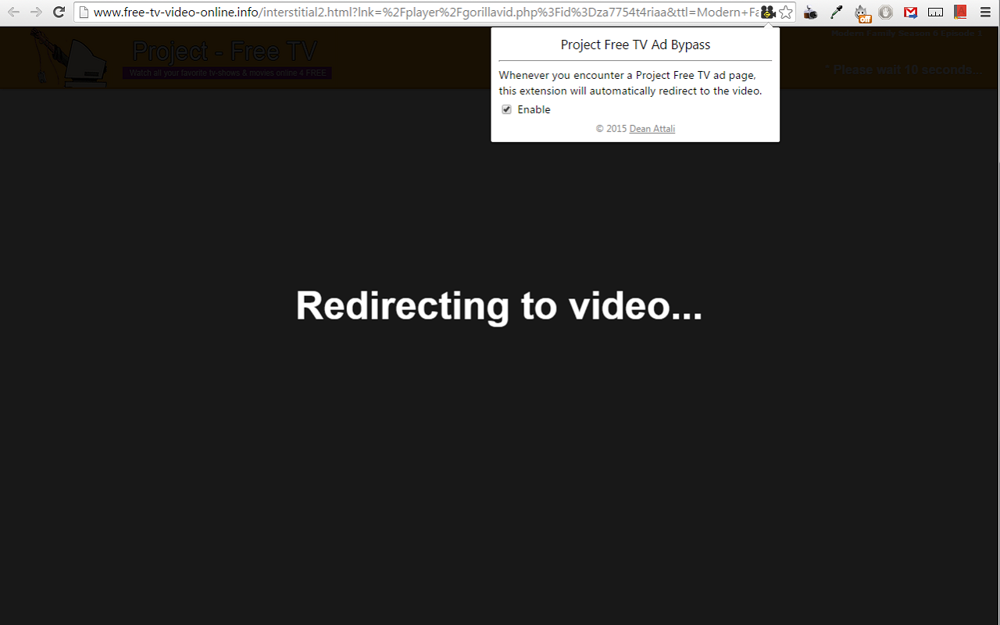

# Project Free TV Ad Bypass (Chrome extension)

> *Copyright 2015 [Dean Attali](http://deanattali.com). Licensed under the MIT license.*

_Source code available [on GitHub](https://github.com/daattali/pftv-ad-bypass-extension)_     
_Get the extension at the [Chrome Web Store](https://chrome.google.com/webstore/detail/project-free-tv-ad-bypass/modfjcgeknfglkdgckkomdcgokkjaadd)_  

## Installation

Installation is extremely easy: just go to [the Chrome extension store](https://chrome.google.com/webstore/detail/project-free-tv-ad-bypass/modfjcgeknfglkdgckkomdcgokkjaadd) and click on the "Add to Chrome" button.

## Description

Project Free TV is a great site that hosts links to streams of movies and TV shows. However, it recently (July 2015) started showing an interstitial ad page that forces you to click on a button to go to the actual video page.  This extension bypasses that page and lets you go straight to the video. Simple.

The first version of this extension (March 2015) was because PFTV started showing an ad page on every link that the user can't skip for at least 10 seconds before being able to continue to the video.  I was not happy with having to wait 10 seconds for every link that I clicked, so I built this extension to redirect to the video from the ad page automatically without waiting 10 seconds.

The original PFTV website is shut down and now uses a different URL, so this is updated as of Feb 26, 2016.

It's a very simple extension, there isn't much to it - that's all it does.

## Screenshot

When you reach an ad page, this extension will detect it automatically and immediately redirect to the video.

## My other extensions

[Google Slides Auto Resize Speaker Notes](https://github.com/daattali/gslides-betternotes-extension) - the slides thumbnails in the Speaker Notes window of Google Slides are tiny. This extension dynamically resizes the slides to be more readable based on the window size.

[GitHub Diff Navigator](https://github.com/daattali/github-diff-navigator-extension) - Chrome extension that allows you to easily navigate through the changes in a file that has been edited on GitHub.

[Smileyfy My Facebook](https://github.com/daattali/smileyfy-my-facebook-extension) - Chrome extension that adds infinite happiness to your Facebook browsing, plus a little bonus rickrolling :) 

---

To see my other projects, visit [http://deanattali.com/projects](http://deanattali.com/projects)
